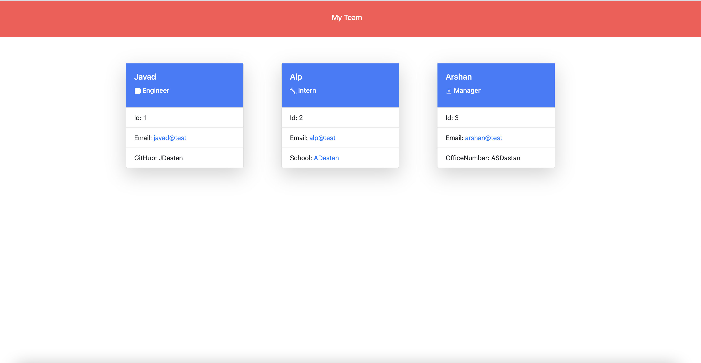

# Team Profile Generator
## Description

- This was great project to be part of. -I build a Node.js command-line application that takes in information about employees on a software engineering team and generates an HTML webpage that displays summaries for each person.
- I had a litle bit problem to generate html page.
- I learn so much about Node.js and oop

## Installation

Please see below guidelines the project on your local machine in order to be able to run;

- Since Node.js applications don't have a front end, clone or download the repository to your own local machine and run it from your command line
- Then, make sure that your repo includes a package.json with the required dependencies. You can create one by running npm init in your command line
- Run npm i or npm install in order to download all the dependencies. Make sure to also download Inquirer.js by entering npm install inquirer in your terminal in the root directory of the project. Learn more about this package on npm documentation.
- Run node index.js or node index in your terminal to launch the application, the first question will appear in your terminal.
- To make sure the Jest tests work, run npm run test and inspect what the CLI returns.

## Usage

 https://github.com/ZDastan/team-profile-generator

